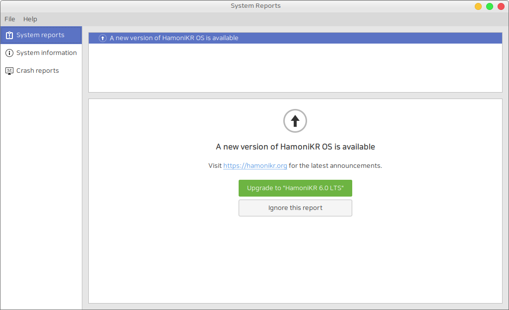

# HamoniKR Report


이 프로그램은 충돌 보고서를 분석하고 중요한 정보를 찾아내는 문제 해결 도구입니다.

 * 새 버전 하모니카 OS 업데이트 알림
 * 시스템 충돌 보고서를 다른 사람과 쉽게 공유하여 문제 해결을 돕는 기능
 * 멀티미디어 코덱 설치 유무 확인
 * 하모니카OS 업데이트 지원 종료 기간 확인
 * 누락된 언어 지원 패키지 설치
 * 최신 장치 드라이버 유무 확인



## Build
Get source code
```
git clone https://github.com/hamonikr/hamonikrreport
cd hamonikrreport
```

Build
```
dpkg-buildpackage --no-sign
```

Install
```
cd ..
sudo dpkg -i hamonikrreport*.deb
```

## License
- Code: GPLv3
